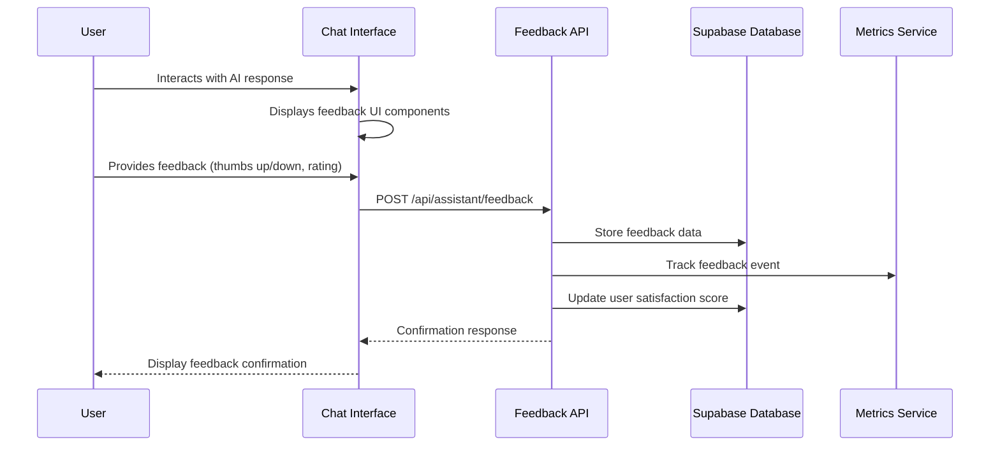
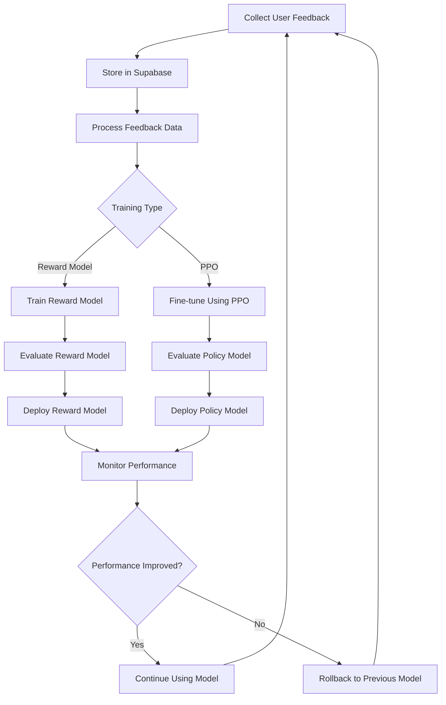

# Massachusetts Clean Tech Ecosystem Assistant

## Overview
This platform connects job seekers with clean tech opportunities in Massachusetts, with a focus on Environmental Justice communities and Gateway Cities. It uses AI-powered resume analysis to provide personalized career pathways, education recommendations, and job matches.

## Table of Contents
- [Strategic Context](#strategic-context)
- [Target Populations](#target-populations)
- [Target Locations](#target-locations)
- [Core Features](#core-features)
- [Project Structure](#project-structure)
- [Technologies](#technologies)
- [Implementation Strategy](#implementation-strategy)
  - [Phase 1: Core Infrastructure](#phase-1-core-infrastructure-week-1-2)
  - [Phase 2: Resume Analysis & Job Matching](#phase-2-resume-analysis--job-matching-week-3-4)
  - [Phase 3: Military & International Credentials](#phase-3-military--international-credentials-week-5-6)
  - [Phase 4: Gateway Cities & EJ Communities](#phase-4-gateway-cities--ej-communities-week-7-8)
  - [Phase 5: Metrics & Monitoring](#phase-5-metrics--monitoring-week-9-10)
  - [Phase 6: Hybrid Search & Real-time Features](#phase-6-hybrid-search--real-time-features-week-11-12)
  - [Phase 7: UI/UX Polish & Performance Optimization](#phase-7-uiux-polish--performance-optimization-week-13-14)
- [Database Schema](#database-schema)
- [Technical Implementation](#technical-implementation)
  - [Memory Service](#memory-service)
  - [Agent Workflow](#agent-workflow)
  - [Data Ingestion Process](#data-ingestion-process)
  - [User Assessment Process](#user-assessment-process)
- [System Architecture](#system-architecture)
- [Integration Points](#integration-points)
- [Getting Started](#getting-started)
- [Deployment](#deployment)
- [Recent Updates](#recent-updates)
- [Prerequisites](#prerequisites)
- [Environment Variables](#environment-variables)
- [Installation](#installation)
- [Using the Hybrid Search](#using-the-hybrid-search)
- [Using Streaming Responses](#using-streaming-responses)
- [Reinforcement Learning from Human Feedback (RLHF)](#reinforcement-learning-from-human-feedback-rlhf)
- [Profile Enrichment](#profile-enrichment)
- [Enhanced Job Search](#enhanced-job-search)
- [Metrics Dashboard](#metrics-dashboard)

## Strategic Context
The Climate Ecosystem Assistant is designed to create a just, rapid, and equitable climate transition by connecting underrepresented communities with training and career opportunities in renewable energy, clean transportation, and decarbonizing buildings.

## Target Populations
- Residents of Environmental Justice neighborhoods
- Individuals from low-income backgrounds
- Minority and Women-owned Business Enterprises
- Veterans transitioning to civilian careers
- International professionals with overseas credentials
- Workforce reentry candidates

## Target Locations
Brockton, Boston, Fall River/New Bedford, Lawrence/Lowell, Springfield, Worcester, and other Massachusetts Gateway Cities.

## Core Features
- Resume parsing and analysis with climate tech relevance scoring
- Skill gap identification and recommendation engine
- Career pathway generation for clean tech sectors
- Education and training program matching
- Military skills translator and credential evaluator
- Real-time processing with streaming updates

## Project Structure
```
climate_economy_ecosystem/
├── app/                  # Next.js application pages and API routes
│   ├── admin/            # Admin interface and dashboard
│   ├── api/              # API routes for backend functionality
│   ├── assistant/        # Assistant interface
│   ├── auth/             # Authentication pages
│   ├── dashboard/        # User dashboard
│   └── profile/          # User profile management
├── components/           # Reusable UI components
│   ├── Admin/            # Admin components
│   ├── Auth/             # Authentication components
│   ├── Chat/             # Chat interface components
│   ├── ClimateChat/      # Climate chat specific components
│   ├── Dashboard/        # Dashboard components
│   ├── EJCommunitySupport/ # Environmental Justice support
│   ├── Feedback/         # Feedback collection components
│   ├── Profile/          # Profile components
│   ├── Search/           # Search interface components
│   ├── SectorExplorer/   # Clean energy sector exploration
│   ├── SkillsAnalysis/   # Skills analysis components
│   └── ui/               # Generic UI components
├── database/             # Database migrations and schema
│   ├── migrations/       # SQL migration files
│   └── seeds/            # Database seed data
├── docs/                 # Documentation files
├── graph/                # LangGraph agent definitions
├── hooks/                # Custom React hooks
├── lib/                  # Shared libraries
│   ├── assistant/        # Assistant logic
│   ├── memory/           # Memory management (mem0)
│   ├── ml/               # Machine learning components
│   ├── monitoring/       # Metrics and monitoring
│   └── tools/            # Tool definitions for agents
├── prompts/              # System prompts for agents
├── public/               # Static files
├── scripts/              # Utility scripts
├── tools/                # Python tools and utilities
│   ├── climate_economy_ecosystem/ # Tool implementations
│   ├── examples/         # Example use cases
│   ├── scripts/          # Tool-specific scripts
│   ├── templates/        # Templates for generation
│   └── utils/            # Tool utilities
└── .github/workflows/    # GitHub Actions workflows
```

## Technologies
- Next.js 14 with App Router
- DaisyUI for styling (following ACT brand guidelines)
- LangGraph for agent orchestration
- LangChain for LLM integration
- Supabase for data persistence
- Socket.IO for real-time updates

## Implementation Strategy

This section outlines the phased implementation approach for building the Climate Economy Ecosystem Assistant. Each phase has specific deliverables, dependencies, and testing criteria to ensure a structured development process.

### Phase 1: Core Infrastructure (Week 1-2)

**Objective:** Set up the foundational architecture and core services.

**Deliverables:**
1. **Database Schema and Setup**
   - Complete base schema with tables for users, memories, and events
   - Initial migration script
   - Vector search capabilities
   - Integration with Supabase

2. **Memory System**
   - Implement memory storage and retrieval with mem0
   - Vector embedding pipeline for climate data
   - Basic search functionality

3. **User Authentication**
   - Authentication routes with Supabase Auth
   - User login and registration interfaces
   - Session management and persistence

4. **Core Application Structure**
   - Main application layout with auth context
   - Landing page with introduction to the assistant
   - Basic styling with DaisyUI

5. **Chat Interface**
   - Chat interface component
   - Climate chat API endpoint
   - Integration with memory and search services

6. **Dashboard**
   - User dashboard with action cards and chat
   - Integration with user profile data

7. **Knowledge Base Data Ingestion**
   - Script for crawling and indexing company resources
   - Company resource indexing with duplicate prevention
   - PDF report processing and chunking for key climate reports
   - Integration with Supabase vector search

### Phase 2: Resume Analysis & Job Matching (Week 3-4)

**Objective:** Implement resume parsing, skill extraction, and job matching capabilities.

**Deliverables:**
1. **User Assessment Flow**
   - User type identification questionnaire
   - Background assessment with targeted questions
   - Resume upload and parsing functionality
   - User profile creation and storage in Supabase

2. **Resume Processing Pipeline**
   - Resume parsing and content extraction
   - Skill identification and categorization
   - Experience level determination
   - Military skill translation for veterans

3. **Job Matching System**
   - Skill-based job recommendation engine
   - Company matching based on user profile
   - Job search API and UI components
   - Results filtering and personalization

4. **Profile-Based Recommendations**
   - Educational pathway recommendations
   - Skill gap analysis
   - Training program matching
   - Career transition guidance

### Phase 3: Military & International Credentials (Week 5-6)

**Objective:** Implement specialized tools for veterans and international professionals.

**Deliverables:**
1. **Military Skills Translation**
   - MOS code translation and skills mapping
   - UI for veterans
   - Military background extraction from resumes
   - Integration with veteran support resources

2. **International Credential Evaluation**
   - Foreign credential analysis
   - UI for international professionals
   - African credentials database and matching system
   - Credential gap analysis and recommendation engine

3. **Specialized Prompts**
   - Prompts for veteran career pathways
   - Prompts for international credential evaluation
   - Integration with main agent workflow

4. **Profile Enhancements**
   - Enhanced profile page with veteran/international sections
   - Military background editor
   - International credentials editor

### Phase 4: Gateway Cities & EJ Communities (Week 7-8)

**Objective:** Implement location-specific personalization and EJ community support.

**Deliverables:**
1. **Location-Based Services**
   - Location-specific opportunity identification
   - UI for location-based recommendations
   - Integration with Massachusetts Gateway Cities data
   - Geospatial search functionality

2. **EJ Community Support**
   - EJ community identification and specialized support
   - UI for EJ community resources
   - Distance-based opportunity filtering
   - Support program matching for EJ communities

3. **Training Program Locator**
   - API endpoint for location-based recommendations
   - UI for training recommendations
   - Location-filtered training program database
   - Support service integration for EJ communities

4. **Clean Energy Sector Mapping**
   - Sector-specific recommendation refinement
   - Location-sector opportunity mapping
   - UI for exploring clean energy sectors by location

### Phase 5: Metrics & Monitoring (Week 9-10)

**Objective:** Implement comprehensive tracking, monitoring, and feedback systems.

**Deliverables:**
1. **Metrics Service**
   - Core metrics collection and analysis
   - Event tracking for user interactions
   - Performance monitoring for key API endpoints
   - User satisfaction measurement

2. **Admin Dashboard**
   - Admin dashboard for system metrics
   - Metrics visualization
   - User behavior analytics
   - Alert system for performance issues

3. **Feedback Collection**
   - API endpoint for user feedback
   - Feedback collection UI
   - Recommendation quality tracking
   - A/B testing framework for recommendation approaches

4. **Usage Analytics**
   - Location and demographic usage patterns
   - Recommendation effectiveness tracking
   - Usage visualization
   - Report generation for stakeholders

### Phase 6: Hybrid Search & Real-time Features (Week 11-12)

**Objective:** Enhance search capabilities and implement real-time features.

**Deliverables:**
1. **Hybrid Search System**
   - Web search integration
   - Enhanced database retrieval
   - Combined search pipeline with ranking
   - Advanced search UI
   - Hybrid search API endpoint with sophisticated ranking
   - LangSmith tracing for search analytics and debugging

2. **Real-time Streaming**
   - Integration of LangSmith tracing for debugging and analytics
   - Token-by-token response streaming
   - UI for streaming responses
   - Streaming API endpoint with real-time processing

3. **Notification System**
   - Notifications API
   - Database support for notifications
   - Notifications UI
   - Notifications context provider
   - Real-time Socket.IO server
   - Push notification support

4. **Collaborative Features**
   - Career counselor collaboration tools
   - Shared annotation and commenting
   - Multi-user resume review

### Phase 7: UI/UX Polish & Performance Optimization (Week 13-14)

**Objective:** Finalize the user interface and optimize application performance.

**Deliverables:**
1. **UI Enhancement**
   - Design system implementation
   - Accessibility improvements
   - Mobile responsiveness
   - Animation and transition refinement

2. **Performance Optimization**
   - API response time improvements
   - Client-side caching strategy
   - Server-side rendering optimization
   - Database query optimization

3. **Documentation**
   - User documentation
   - Developer documentation
   - API documentation
   - Deployment guide

4. **Final Testing**
   - End-to-end testing
   - Load testing
   - Usability testing with target populations
   - Security audit

## Database Schema

### Key Tables

```sql
-- Enable UUID extension
CREATE EXTENSION IF NOT EXISTS "uuid-ossp";

-- Enable pgvector extension for vector embeddings
CREATE EXTENSION IF NOT EXISTS "vector";

-- climate_memories table (for mem0 storage)
CREATE TABLE IF NOT EXISTS climate_memories (
    id UUID PRIMARY KEY DEFAULT uuid_generate_v4(),
    content TEXT NOT NULL,
    user_id TEXT NOT NULL,
    embedding VECTOR(1536),
    metadata JSONB DEFAULT '{}'::JSONB,
    created_at TIMESTAMP WITH TIME ZONE DEFAULT NOW()
);

-- User profiles table
CREATE TABLE IF NOT EXISTS user_profiles (
    id UUID PRIMARY KEY DEFAULT uuid_generate_v4(),
    user_id TEXT UNIQUE NOT NULL,
    name TEXT,
    email TEXT,
    location TEXT,
    is_ej_community BOOLEAN DEFAULT FALSE,
    gateway_city TEXT,
    is_veteran BOOLEAN DEFAULT FALSE,
    military_background JSONB,
    international_credentials JSONB,
    preferences JSONB DEFAULT '{}'::JSONB,
    created_at TIMESTAMP WITH TIME ZONE DEFAULT NOW(),
    updated_at TIMESTAMP WITH TIME ZONE DEFAULT NOW()
);

-- Events table for metrics tracking
CREATE TABLE IF NOT EXISTS events (
    id UUID PRIMARY KEY DEFAULT uuid_generate_v4(),
    event_type TEXT NOT NULL,
    user_id TEXT NOT NULL,
    timestamp TIMESTAMP WITH TIME ZONE DEFAULT NOW(),
    properties JSONB DEFAULT '{}'::JSONB,
    session_id TEXT
);

-- Companies table
CREATE TABLE IF NOT EXISTS companies (
    id UUID PRIMARY KEY DEFAULT uuid_generate_v4(),
    name TEXT NOT NULL,
    career_page TEXT,
    location TEXT,
    sector TEXT,
    description TEXT,
    created_at TIMESTAMP WITH TIME ZONE DEFAULT NOW()
);

-- Job opportunities table
CREATE TABLE IF NOT EXISTS job_opportunities (
    id UUID PRIMARY KEY DEFAULT uuid_generate_v4(),
    company_id UUID REFERENCES companies(id),
    title TEXT NOT NULL,
    description TEXT NOT NULL,
    location TEXT,
    salary_range TEXT,
    requirements JSONB,
    is_ej_friendly BOOLEAN DEFAULT FALSE,
    is_veteran_friendly BOOLEAN DEFAULT FALSE,
    is_international_friendly BOOLEAN DEFAULT FALSE,
    created_at TIMESTAMP WITH TIME ZONE DEFAULT NOW()
);

-- Training programs table
CREATE TABLE IF NOT EXISTS training_programs (
    id UUID PRIMARY KEY DEFAULT uuid_generate_v4(),
    title TEXT NOT NULL,
    provider TEXT NOT NULL,
    location TEXT NOT NULL,
    description TEXT NOT NULL,
    duration TEXT NOT NULL,
    cost TEXT,
    funding_options JSONB,
    requirements TEXT,
    is_ej_focused BOOLEAN DEFAULT FALSE,
    sector TEXT NOT NULL,
    url TEXT,
    created_at TIMESTAMP WITH TIME ZONE DEFAULT NOW()
);

-- Reasoning steps table for RLHF
CREATE TABLE IF NOT EXISTS reasoning_steps (
    id UUID PRIMARY KEY DEFAULT gen_random_uuid(),
    chat_id UUID REFERENCES chats(id) ON DELETE CASCADE,
    step_content TEXT NOT NULL,
    step_order INTEGER NOT NULL,
    created_at TIMESTAMP WITH TIME ZONE DEFAULT NOW()
);

-- Feedback analytics table for RLHF
CREATE TABLE IF NOT EXISTS public.feedback_analytics (
    id UUID PRIMARY KEY DEFAULT gen_random_uuid(),
    user_id UUID REFERENCES auth.users(id) ON DELETE CASCADE,
    total_feedback_count INTEGER DEFAULT 0,
    step_feedback_count INTEGER DEFAULT 0,
    message_feedback_count INTEGER DEFAULT 0,
    positive_step_feedback INTEGER DEFAULT 0,
    negative_step_feedback INTEGER DEFAULT 0,
    positive_message_feedback INTEGER DEFAULT 0,
    negative_message_feedback INTEGER DEFAULT 0,
    average_score FLOAT DEFAULT 3.0,
    created_at TIMESTAMP WITH TIME ZONE DEFAULT timezone('utc'::text, now()),
    updated_at TIMESTAMP WITH TIME ZONE DEFAULT timezone('utc'::text, now())
);
```

### Row Level Security (RLS) Policies
- Users can only view and update their own profiles
- Jobs and training programs are publicly viewable
- Users can only manage their own saved jobs and training programs
- RLHF feedback data is protected with appropriate policies

## Technical Implementation

### Memory Service
```python
# climate_economy_ecosystem/lib/memory/mem0_service.py

from mem0 import Memory
from pydantic import BaseModel, Field
from typing import List, Dict, Optional, Any, Union
import os
from datetime import datetime
import openai

class ClimateMemoryEntry(BaseModel):
    """Memory entry model for climate economy assistant"""
    content: str
    metadata: Dict[str, Any] = Field(default_factory=dict)
    user_id: str
    timestamp: str = Field(default_factory=lambda: datetime.utcnow().isoformat())
    category: str = "report"  # report, job, training, conversation, resume
    source: str = "manual"
    relevance_score: Optional[float] = None

class UserProfile(BaseModel):
    """User profile with resume data and preferences"""
    user_id: str
    name: Optional[str] = None
    email: Optional[str] = None
    location: Optional[str] = None
    is_ej_community: bool = False
    gateway_city: Optional[str] = None
    is_veteran: bool = False
    military_background: Optional[Dict[str, Any]] = None
    international_credentials: Optional[List[Dict[str, Any]]] = None
    resume_data: Optional[Dict[str, Any]] = None
    skills: List[Dict[str, Any]] = Field(default_factory=list)
    interests: List[str] = Field(default_factory=list)
    preferences: Dict[str, Any] = Field(default_factory=dict)
```

### Agent Workflow

```python
# graph/climate_state.py

from typing import TypedDict, List, Dict, Any, Optional

class ClimateState(TypedDict):
    """State for the climate economy agent"""
    user_id: str
    query: str
    context: List[Dict[str, Any]]
    response: Optional[str]
    job_recommendations: List[Dict[str, Any]]
    training_paths: List[Dict[str, Any]]
    reasoning_steps: List[Dict[str, Any]]
    feedback: Optional[Dict[str, Any]]
    is_veteran: bool
    is_ej_community: bool
    is_international: bool

# graph/agents.py

from langchain.agents import AgentExecutor
from langchain.prompts import ChatPromptTemplate
from langchain.tools import Tool
from langchain_openai import ChatOpenAI
from langgraph.graph import StateGraph

from .climate_state import ClimateState
from .tools import DBRetrieverTool, WebSearchTool

def create_agent_workflow():
    """Create the agent workflow for the climate economy assistant"""
    # Create a new graph
    workflow = StateGraph(ClimateState)

    # Add nodes for each step in the workflow
    workflow.add_node("search_jobs", search_jobs)
    workflow.add_node("analyze_skills_fit", analyze_skills_fit)
    workflow.add_node("generate_recommendations_report", generate_recommendations_report)
    workflow.add_node("collect_feedback", collect_feedback)

    # Define the edges between nodes
    workflow.add_edge("search_jobs", "analyze_skills_fit")
    workflow.add_edge("analyze_skills_fit", "generate_recommendations_report")
    workflow.add_edge("generate_recommendations_report", "collect_feedback")

    # Set the entry point
    workflow.set_entry_point("search_jobs")

    # Compile the workflow
    return workflow.compile()
```

#### Agent Implementation Details
```python
# climate_economy_ecosystem/graph/climate_state.py

from typing import Dict, List, Optional, Any, TypedDict, Union
from pydantic import BaseModel

# State definition for climate assistant
class ClimateState(TypedDict):
    """State for climate assistant workflow"""
    user_query: str
    user_id: str
    context: List[Dict[str, Any]]
    retrieved_memories: List[Dict[str, Any]]
    report_insights: List[Dict[str, Any]]
    job_recommendations: List[Dict[str, Any]]
    training_paths: List[Dict[str, Any]]
    response: Optional[str]
    error: Optional[str]
    resume_text: Optional[str]
    resume_analysis: Optional[Dict[str, Any]]
    stream_tokens: Optional[bool]
    socket_id: Optional[str]
    is_ej_community: Optional[bool]
    is_veteran: Optional[bool]
    military_data: Optional[Dict[str, Any]]
    metrics: Dict[str, Any]
    # RLHF-related fields
    reasoning_steps: Optional[List[Dict[str, Any]]]
    feedback_data: Optional[Dict[str, Any]]
    satisfaction_score: Optional[float]
    chat_id: Optional[str]
    message_id: Optional[str]
```

### Data Ingestion Process

The data ingestion process populates our knowledge base with information from various sources that power our clean tech ecosystem assistant. This data includes company information, educational resources, climate reports, and career pathways.

#### Data Sources

1. **Company Resources**: Websites and documentation from ACT member companies
2. **Climate Reports**: PDF documents containing industry analysis and workforce needs
3. **Educational Resources**: Training program information and curriculum details
4. **Career Pathways**: Structured career progression paths in clean energy sectors

#### Ingestion Workflow

The data ingestion process follows these steps:

1. **Data Source Preparation**
   - Company data structured in `constants.py`
   - PDF reports stored in a designated `reports` directory
   - External URLs organized by category and company

2. **Crawling & Processing**
   - Web crawling for all company resources using an approach similar to crawl4ai
   - PDF parsing for report documents using document loaders
   - HTML content extraction and cleaning
   - Smart chunking to preserve contextual meaning

3. **Vector Embedding Generation**
   - Generating embeddings using OpenAI's text-embedding-3-small model (1536 dimensions)
   - Associating rich metadata with each embedded chunk

4. **Supabase Storage**
   - Storing documents with embeddings in Supabase's pgvector-enabled tables
   - Including all relevant metadata for filtering and retrieval

5. **Duplicate Prevention**
   - Tracking ingestion status for each company and resource
   - Persisting status to JSON files to support incremental updates
   - URL-based deduplication to prevent redundant content

#### Implementation Details

The `data_ingestion.py` tool will:

1. Load company information from the updated `constants.py` file
2. Check which companies/resources have already been indexed
3. Process unindexed companies in batches
4. For each company:
   - Crawl all resources listed in their profile
   - Extract relevant content
   - Generate chunks appropriate for semantic search
   - Create embeddings
   - Store in Supabase with company metadata
   - Mark as indexed to prevent future duplication
5. Process PDF reports similarly, with specialized chunking for structured documents
6. Save indexing status after processing to support incremental updates

### User Assessment Process

The user assessment process is a critical component for personalizing recommendations. It follows these steps:

#### 1. Initial User Type Identification

Users are presented with a simple questionnaire to identify their background:

```
Which best describes your current situation?
- [ ] Military veteran or transitioning service member
- [ ] International professional with foreign credentials
- [ ] Student (vocational/community college/university)
- [ ] Career changer from another industry
- [ ] Current clean energy professional seeking advancement
- [ ] Massachusetts resident from an Environmental Justice community
```

#### 2. Targeted Follow-up Questions

Based on the user type, 2-3 targeted questions are presented:

**For Veterans:**
- How recently did you transition from military service?
- What was your primary military occupational specialty (MOS)?
- What clean energy sector are you most interested in?

**For International Professionals:**
- In which country did you obtain your credentials?
- What is your professional field of expertise?
- Have you had your credentials evaluated in the US?

**For Students:**
- What type of educational institution are you attending?
- What is your field of study?
- When do you expect to complete your program?

**For Career Changers:**
- What industry are you transitioning from?
- What skills from your current role do you believe are transferable?
- Are you currently employed?

#### 3. Resume Collection

Users are prompted to:
- Upload their resume (PDF, DOCX, or TXT format)
- Or paste the text of their resume directly
- Optionally provide LinkedIn profile URL for additional information

#### 4. Profile Creation

The system:
1. Parses the resume to extract key information
2. Combines resume data with questionnaire responses
3. Creates a comprehensive user profile stored in Supabase
4. Identifies skill sets, experience level, and background
5. For veterans, translates military skills to civilian equivalents

#### 5. Personalized Recommendations

Based on the user profile, the system provides:
- **Job Recommendations**: From our partner companies matching their skills and interests
- **Skill Gap Analysis**: Identifying skills needed for desired roles
- **Educational Pathways**: Courses, certifications, or programs to close skill gaps
- **Career Transition Guidance**: Personalized roadmaps based on their background
- **Company Connections**: Introducing companies with relevant opportunities

## System Architecture

```
┌───────────────┐      ┌─────────────────┐     ┌───────────────┐
│   Next.js UI  │      │  FastAPI Server  │     │  Supabase DB  │
│  (React app)  │◄────►│ (Python backend) │◄───►│ (PostgreSQL)  │
└───────┬───────┘      └────────┬─────────┘     └───────────────┘
        │                       │                       ▲
        │                       │                       │
        │                       ▼                       │
┌───────▼───────┐      ┌─────────────────┐     ┌───────▼───────┐
│   User Chat   │      │   LangGraph     │     │     mem0      │
│  Interface    │─────►│   Workflow      │◄────►│ Memory System │
└───────────────┘      └────────┬─────────┘     └───────────────┘
                                │                       ▲
                                │                       │
                                ▼                       │
                       ┌─────────────────┐     ┌───────▼───────┐
                       │  Agent Tools    │     │  Redis Cache  │
                       │ - DB Retriever  │◄────►│               │
                       │ - Web Search    │     └───────────────┘
                       │ - Resume Analyzer│            ▲
                       └───────┬─────────┘            │
                               │                      │
                               ▼                      │
                       ┌─────────────────┐    ┌───────▼───────┐
                       │  Metrics        │    │  Web Services │
                       │  Monitoring     │────►  (External)   │
                       └─────────────────┘    └───────────────┘
```

## Integration Points
- Next.js frontend with DaisyUI components
- Python backend with FastAPI
- LangGraph for agent orchestration
- Supabase for data and authentication
- Redis for caching and rate limiting
- Socket.IO for real-time updates

## Getting Started

### Prerequisites

- Node.js 18+ and npm
- Python 3.9+
- Supabase account
- OpenAI API key
- Docker and Docker Compose (for Docker setup)

### Installation (Standard Setup)

```bash
# Clone the repository
git clone https://github.com/yourusername/climate-economy-ecosystem.git
cd climate-economy-ecosystem

# Install dependencies
npm install
pip install -r requirements.txt

# Set up environment variables
cp .env.example .env.local
# Edit .env.local with your API keys and configuration

# Run database migrations
python setup_rlhf_tables.py

# Start the development server
npm run dev
```

To start developing:

1. Clone the repository
2. Install dependencies with `npm install` and `pip install -r requirements.txt`
3. Set up environment variables
4. Initialize Supabase tables
5. Run database migrations
6. Start the development server with `npm run dev`

### Docker Setup (Recommended)

The easiest way to run the Climate Economy Ecosystem is using Docker. This ensures a consistent environment and simplifies setup.

```bash
# Clone the repository
git clone https://github.com/yourusername/climate-economy-ecosystem.git
cd climate-economy-ecosystem

# Create .env file with your configuration
cp .env.example .env

# Generate secure keys for local development
npm run generate-keys

# Start the application in production mode
npm run docker:prod

# Access the application at http://localhost:3000
```

#### Docker Commands

**Production Commands**:
- **Start production environment**: `npm run docker:prod`
- **Build production containers**: `npm run docker:prod:build`
- **Start production containers**: `npm run docker:prod:up`
- **Stop production containers**: `npm run docker:prod:down`

**Development Commands**:
- **Build containers**: `npm run docker:build`
- **Start all containers**: `npm run docker:up`
- **Stop containers**: `npm run docker:down`
- **Run all in development mode**: `npm run docker:dev`

**Component-Specific Commands**:
- **Run frontend only**: `npm run docker:dev:frontend`
- **Run Python backend only**: `npm run docker:dev:python`

**Testing Commands**:
- **Run all tests**: `npm run docker:test`
- **Run frontend tests only**: `npm run docker:test:frontend`
- **Run Python tests only**: `npm run docker:test:python`

**Database Commands**:
- **Run migrations**: `npm run docker:migrate`

**For detailed Docker setup instructions, see [DOCKER_SETUP.md](DOCKER_SETUP.md)**

### Security Best Practices

#### Environment Variables and Secrets

This project uses environment variables to manage sensitive information like API keys and database credentials. Follow these best practices:

1. **Never commit secrets to version control**
   - The `.env` file is included in `.gitignore` to prevent accidental commits
   - Use `npm run generate-keys` to create secure random keys for local development

2. **Use different secrets for each environment**
   - Development, testing, and production should use different keys
   - For production, use a secure secret management system

3. **Rotate secrets regularly**
   - Change your JWT secrets and API keys periodically
   - Update environment variables after rotation

4. **Limit access to secrets**
   - Only share secrets with team members who need them
   - Use role-based access control for production secrets

## Deployment
The application is designed for deployment on Vercel with API functions connecting to Supabase.

## Recent Updates

### Phase 6: Hybrid Search & Real-time Features

We've recently enhanced the platform with improved search capabilities and real-time features:

#### Hybrid Search System
- Advanced search UI with filtering, history, and feedback mechanisms
- Combined search pipeline that merges database and web results
- Sophisticated ranking algorithms that balance relevance and recency
- Source attribution and category detection for better results

#### Real-time Streaming
- Token-by-token streaming responses for a more interactive experience
- Markdown support for formatted responses
- Source attribution for transparency
- Ability to cancel streaming mid-response

#### Performance Monitoring with LangSmith
- Integrated LangSmith tracing throughout the application
- Detailed step-by-step tracing of search and chat operations
- Performance analytics for API endpoints
- Error tracking and debugging capabilities

## Prerequisites

- Node.js 18+
- Python 3.9+
- Supabase account
- Astra DB account
- OpenAI API key
- LangSmith API key (for tracing)

## Environment Variables

Configure the following environment variables in your `.env` file:

```
# LLM Configuration
OPENAI_API_KEY=your-openai-api-key

# Database Configuration
SUPABASE_URL=your-supabase-url
SUPABASE_ANON_KEY=your-supabase-anon-key
SUPABASE_SERVICE_KEY=your-supabase-service-key

# LangSmith Tracing Configuration
LANGCHAIN_TRACING_V2=true
LANGCHAIN_ENDPOINT=https://api.smith.langchain.com
LANGCHAIN_PROJECT=your-project-name
LANGCHAIN_API_KEY=your-langsmith-api-key
```

## Installation

1. Clone the repository
   ```
   git clone https://github.com/your-username/climate-economy-ecosystem.git
   cd climate-economy-ecosystem
   ```

2. Install dependencies
   ```
   npm install
   pip install -r requirements.txt
   ```

3. Run the development server
   ```
   npm run dev
   ```

## Using the Hybrid Search

The hybrid search component provides a more powerful search experience:

```jsx
import HybridSearch from '@/components/Search/HybridSearch';

export default function SearchPage() {
  return (
    <div className="container mx-auto py-8">
      <h1 className="text-2xl font-bold mb-4">
        Search Clean Energy Resources
      </h1>
      <HybridSearch />
    </div>
  );
}
```

## Using Streaming Responses

For chat interfaces that need real-time streaming:

```jsx
import StreamingResponse from '@/components/Chat/StreamingResponse';

export default function ChatInterface() {
  const [query, setQuery] = useState('');

  return (
    <div>
      <input
        value={query}
        onChange={(e) => setQuery(e.target.value)}
        placeholder="Ask a question..."
      />

      <StreamingResponse
        query={query}
        showSources={true}
        onComplete={(response, sources) => {
          console.log('Chat completed:', response);
        }}
      />
    </div>
  );
}
```

## Reinforcement Learning from Human Feedback (RLHF)

The Climate Economy Ecosystem includes a comprehensive RLHF system that captures user feedback at multiple levels:

- Message-level feedback (thumbs up/down on entire responses)
- Step-level feedback (targeted feedback on specific reasoning steps)
- Numeric rating scale (1-5 star ratings)

This feedback data is used to:
1. Train a reward model that predicts user satisfaction
2. Fine-tune the language model using Proximal Policy Optimization (PPO)
3. Continuously improve response quality based on user preferences

#### System Components

The RLHF implementation includes:
- Database schemas for capturing structured feedback (chat_feedback table)
- Client-side components for collecting user ratings (StepFeedback and MessageFeedback)
- API endpoints for storing and retrieving feedback (/api/assistant/feedback and /api/metrics/chat-feedback)
- Metrics service integration for tracking feedback patterns
- RLHF analytics dashboard for monitoring model performance
- Training scripts for model optimization using the TRL library
- GitHub workflow for automated retraining on a weekly schedule

#### Feedback Collection Process

The system collects feedback through multiple channels:
1. **Message-level feedback**: Users can rate entire AI responses using thumbs up/down buttons
2. **Step-level feedback**: Users can provide granular feedback on specific reasoning steps
3. **Explicit ratings**: Users can provide numeric scores (1-5) for more detailed feedback
4. **Implicit signals**: The system tracks engagement metrics like time spent reading responses

#### Training Pipeline

The RLHF training process follows these steps:
1. **Data preprocessing**: Clean and prepare feedback data for training
2. **Reward model training**: Train a model to predict user satisfaction scores
3. **PPO fine-tuning**: Optimize the language model using reinforcement learning
4. **Evaluation**: Test model performance against baseline on various metrics
5. **Deployment**: Update the production model with improved weights

#### Monitoring and Analytics

The RLHF system includes a dedicated metrics dashboard that provides:
- Feedback trends over time (daily, weekly, monthly)
- Distribution of feedback scores across different user segments
- Top areas for improvement based on negative feedback
- Model performance metrics before and after training
- A/B testing results comparing different model versions

To train the model with RLHF:
```bash
# Run the training script
./scripts/train_model.sh

# Options: reward, ppo, or both
./scripts/train_model.sh reward  # Train only reward model
./scripts/train_model.sh ppo     # Fine-tune using PPO
./scripts/train_model.sh both    # Run the complete pipeline
```

#### Integration with Graph Agents

The RLHF system is fully integrated with the LangGraph agent framework:
- Feedback is collected at each step of agent reasoning
- Structured validators ensure data quality for training
- Agent behavior is optimized based on user preferences
- Complex workflows receive targeted improvement based on step-level feedback

#### RLHF Workflow Diagrams

##### Feedback Collection Flow



##### Training Pipeline Flow



#### RLHF Implementation Code

Here's a key excerpt from the reward model implementation:

```python
class ClimateRewardModel:
    def __init__(self, model_name="distilbert-base-uncased", model_path=None):
        self.tokenizer = AutoTokenizer.from_pretrained(model_name)

        if model_path and os.path.exists(model_path):
            self.model = AutoModelForSequenceClassification.from_pretrained(model_path)
        else:
            self.model = AutoModelForSequenceClassification.from_pretrained(
                model_name,
                num_labels=1  # Regression task for reward score
            )

        self.device = torch.device("cuda" if torch.cuda.is_available() else "cpu")
        self.model.to(self.device)

    def compute_reward(self, query, response):
        """Predict reward score for a query-response pair"""
        inputs = self.tokenizer(
            query, response,
            return_tensors="pt",
            truncation=True,
            padding=True,
            max_length=512
        ).to(self.device)

        with torch.no_grad():
            outputs = self.model(**inputs)
            reward = outputs.logits.item()

        return reward

    def train(self, feedback_data, output_dir="data/reward_model", epochs=3):
        """Train the reward model on human feedback data"""
        # Implementation details...
```

## Profile Enrichment

The profile enrichment feature uses natural language processing and web search to enhance user profiles with relevant skills based on their education, experience, and professional background. This helps improve job matching and provides more personalized job recommendations.

### Key Features

- **Skill Extraction**: Automatically extracts technical, transferable, and soft skills from user profiles.
- **Web Search Integration**: Uses the Serper API to search for additional information about the user's background.
- **Verification Interface**: Users can review and verify extracted skills before they're added to their profiles.
- **Privacy-Focused**: Only searches for information from trusted sources within the ecosystem.

### Setup Requirements

1. Add your Serper API key to the `.env` file:
   ```
   SERPER_API_KEY=your_serper_api_key
   ```

2. Run the Supabase migration to add the required schema changes:
   ```
   npx supabase db push
   ```

## Enhanced Job Search

The enhanced job search feature leverages user profile data and enrichment information to provide more relevant job matches and personalized recommendations.

### Key Features

- **Profile-Based Matching**: Uses enriched user profiles to find relevant job opportunities.
- **Skill Matching**: Identifies jobs that match the user's technical, transferable, and soft skills.
- **Recommendations**: Provides job recommendations based on the user's profile and interests.
- **Member Company Focus**: Prioritizes jobs from member companies within the climate economy ecosystem.

### Usage

1. Access the enhanced job search at `/jobs/enhanced-search`.

## Authentication System

The system uses NextAuth.js with Supabase for authentication. Currently, it supports email/password authentication, but Google authentication needs to be implemented.

### Current Implementation

```javascript
// NextAuth configuration in app/api/auth/[...nextauth]/route.js
const handler = NextAuth({
  providers: [
    CredentialsProvider({
      name: 'Email and Password',
      credentials: {
        email: { label: 'Email', type: 'email' },
        password: { label: 'Password', type: 'password' }
      },
      async authorize(credentials) {
        // Authenticate with Supabase
        const { data, error } = await supabase.auth.signInWithPassword({
          email: credentials.email,
          password: credentials.password,
        });

        if (error || !data.user) return null;

        // Get user profile
        const { data: profileData } = await supabase
          .from('profiles')
          .select('*')
          .eq('id', data.user.id)
          .single();

        // Return user with profile data
        return {
          id: data.user.id,
          email: data.user.email,
          name: profileData?.full_name || data.user.email,
          role: profileData?.role || 'user',
          image: profileData?.avatar_url,
          profile: profileData || {},
        };
      }
    })
  ],
  // Additional configuration...
});
```

### Google Authentication Setup (To Be Implemented)

To add Google authentication:

1. Create OAuth credentials in the Google Cloud Console
2. Add the GoogleProvider to the NextAuth configuration:

```javascript
import GoogleProvider from 'next-auth/providers/google';

const handler = NextAuth({
  providers: [
    GoogleProvider({
      clientId: process.env.GOOGLE_CLIENT_ID,
      clientSecret: process.env.GOOGLE_CLIENT_SECRET,
    }),
    // Existing CredentialsProvider...
  ],
  // Additional configuration...
});
```

3. Add the required environment variables to `.env.local`:

```
GOOGLE_CLIENT_ID=your_google_client_id
GOOGLE_CLIENT_SECRET=your_google_client_secret
```

## Metrics Dashboard

The system includes a comprehensive metrics dashboard for monitoring performance. The dashboard is available at `/admin/metrics` and provides insights into user engagement, profile enrichment, and job search activity.

### Key Features

- **Real-time Metrics**: Displays real-time metrics for user engagement and system performance
- **Time-based Filtering**: Allows filtering metrics by time range (7 days, 30 days, 90 days)
- **Chart Visualizations**: Provides visual representations of key metrics using Chart.js
- **Detailed Statistics**: Shows detailed statistics for profile enrichment and job search activity

### Implementation

The metrics dashboard is implemented using:

- **Frontend**: React components with Chart.js for visualizations
- **Backend**: API endpoints that fetch metrics data from Supabase
- **Database**: Metrics tables in Supabase that store event data

```javascript
// Sample metrics dashboard component
const AdminMetricsDashboard = () => {
  const [metricsData, setMetricsData] = useState(null);
  const [timeRange, setTimeRange] = useState('7d'); // 7d, 30d, 90d

  // Fetch metrics data
  useEffect(() => {
    const fetchMetrics = async () => {
      const response = await fetch(`/api/admin/metrics?timeRange=${timeRange}`);
      const data = await response.json();
      setMetricsData(data);
    };

    fetchMetrics();
  }, [timeRange]);

  // Render charts and statistics
  return (
    <div className="metrics-dashboard">
      {/* Time range selector */}
      <div className="time-range-selector">
        {/* Time range buttons */}
      </div>

      {/* Charts and statistics */}
      <div className="metrics-charts">
        {/* User engagement chart */}
        {/* Profile enrichment chart */}
        {/* Job search chart */}
      </div>
    </div>
  );
};
```

### Setup Requirements

1. Ensure the metrics tables are created in Supabase:

```sql
CREATE TABLE public.metrics (
  id UUID PRIMARY KEY DEFAULT gen_random_uuid(),
  event_type TEXT NOT NULL,
  user_id UUID REFERENCES auth.users(id),
  search_data JSONB,
  enrichment_data JSONB,
  verification_data JSONB,
  created_at TIMESTAMP WITH TIME ZONE DEFAULT timezone('utc'::text, now())
);
```

2. Add the required environment variables to `.env.local`:

```
NEXT_PUBLIC_SUPABASE_URL=your_supabase_url
SUPABASE_SERVICE_ROLE_KEY=your_supabase_service_role_key
```


The metrics dashboard provides comprehensive analytics on user engagement, profile enrichment, and job search activity within the Climate Economy Ecosystem.

### Key Features

- **Real-time Metrics**: Displays up-to-date statistics on user activity and engagement.
- **Profile Enrichment Insights**: Tracks profile enrichment metrics, including skills verification rates and distribution.
- **Job Search Analytics**: Monitors search patterns, recommendation effectiveness, and user interactions.
- **Time-based Filtering**: View metrics for different time periods (7 days, 30 days, or 90 days).
- **Chart Visualizations**: Visualizes trends and patterns with interactive charts and graphs.

### Components

The metrics system consists of:

- **Frontend Tracking**: Client-side metrics collection in UI components.
- **Backend Processing**: Server-side aggregation and analysis.
- **Admin Dashboard**: Visualization interface for administrators.
- **Python Metrics Service**: Advanced metrics processing and storage.

### Usage

1. Access the metrics dashboard at `/admin/metrics`.
2. Use the time range selectors to adjust the data timeframe.
3. Navigate between different metric tabs (Overview, Profile Enrichment, Job Search).
4. Export or share insights as needed for reporting.