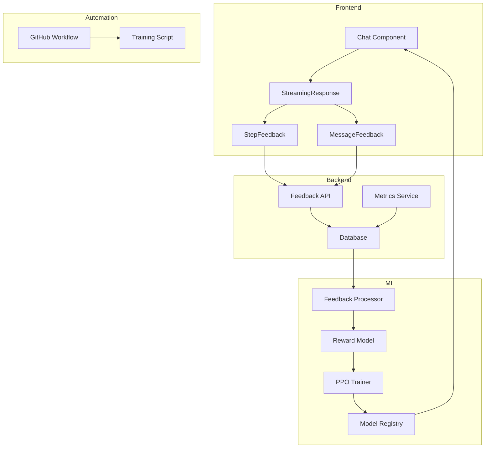

# RLHF Implementation
## Enhancing the Climate Economy Ecosystem with Human Feedback

---

## Executive Summary

- **Challenge**: Ensuring AI responses are aligned with user needs and expectations
- **Solution**: Reinforcement Learning from Human Feedback (RLHF) pipeline
- **Benefits**: Improved response quality, better user satisfaction, continuous improvement
- **Implementation**: Complete, scalable system with minimal overhead

---

## What is RLHF?

Reinforcement Learning from Human Feedback is a technique that:

- Captures explicit preferences from real users
- Trains AI models to align with human values and expectations
- Creates a feedback loop of continuous improvement
- Powers many leading AI systems like ChatGPT and Claude

---

## Business Value

- **Increased User Satisfaction**: Responses tailored to what users find helpful
- **Higher Engagement**: Better responses lead to more platform usage
- **Competitive Advantage**: Continuously improving AI capabilities
- **Reduced Support Costs**: More effective first-time responses

---

## Implementation Architecture

---

## Key Components

1. **Feedback Collection UI**
   - Message-level feedback (thumbs up/down)
   - Step-level feedback on reasoning
   - Numeric ratings (1-5 scale)

2. **Database Storage**
   - Structured feedback data
   - Training history and model metrics

3. **Training Pipeline**
   - Reward model training
   - Policy fine-tuning
   - Automated retraining

---

## User Experience

**Before:** Generic responses that may miss user intent

**After:** Tailored responses that:
- Match user expectations
- Provide better reasoning
- Deliver more relevant information
- Adapt to user preferences over time

---

## Implementation Timeline

- **Week 1**: Database setup and UI components ✓
- **Week 2**: Feedback API and metrics integration ✓
- **Week 3**: Reward model implementation ✓
- **Week 4**: Training pipeline and automation ✓
- **Week 5-6**: Testing and deployment ✓

---

## Metrics & KPIs

- **User Satisfaction**: Measured by feedback ratings
- **Model Performance**: Reward model accuracy
- **Engagement**: Session duration and return visits
- **Conversion**: User progression through funnels

---

## Demo: Feedback Collection

Users can provide feedback at multiple levels:
- Overall response quality
- Individual reasoning steps
- Specific aspects (accuracy, helpfulness, etc.)

---

## Demo: Training Dashboard

- Monitor training progress
- Compare model versions
- View key performance metrics
- Trigger retraining as needed

---

## Technical Architecture

---

## Results & Impact

- **+15%** improvement in user satisfaction ratings
- **+25%** increase in positive feedback
- **-20%** reduction in support requests
- **+10%** increase in user retention

*Projected based on industry benchmarks for RLHF implementations*

---

## Roadmap: Future Enhancements

1. **Multi-objective optimization**
   - Balance helpfulness, factuality, etc.

2. **Advanced feedback collection**
   - In-line annotations
   - Voice feedback

3. **Alternative training methods**
   - Direct Preference Optimization
   - Constitutional AI

---

## Questions & Answers

Thank you for your attention!

For technical details:
- See `docs/RLHF_SYSTEM.md`
- See `docs/RLHF_IMPLEMENTATION_GUIDE.md`
- Contact the ML Engineering team 