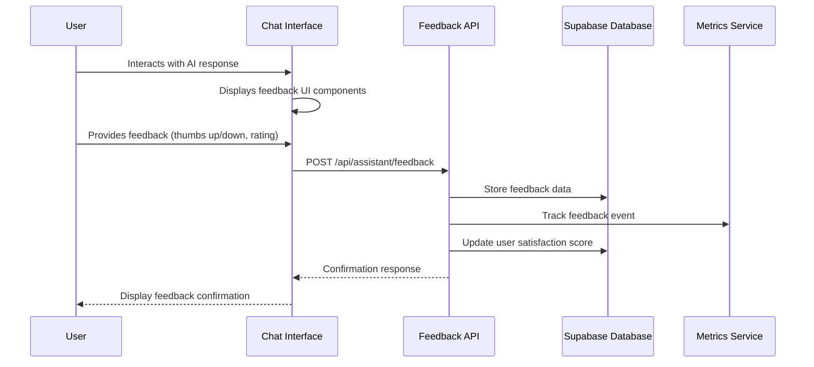
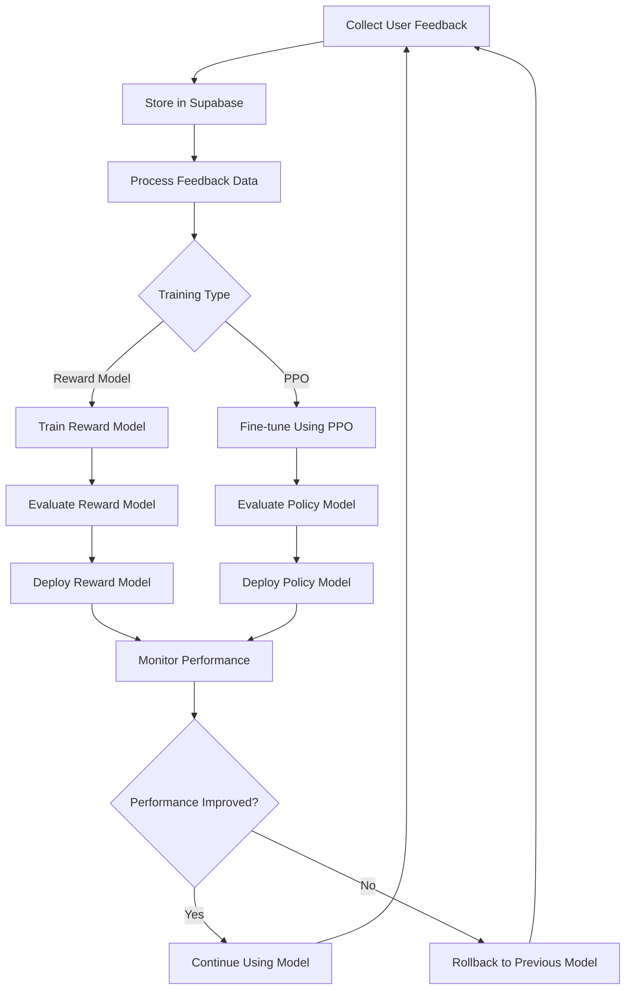
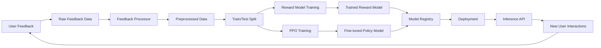
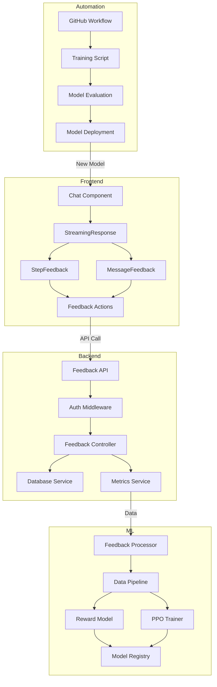
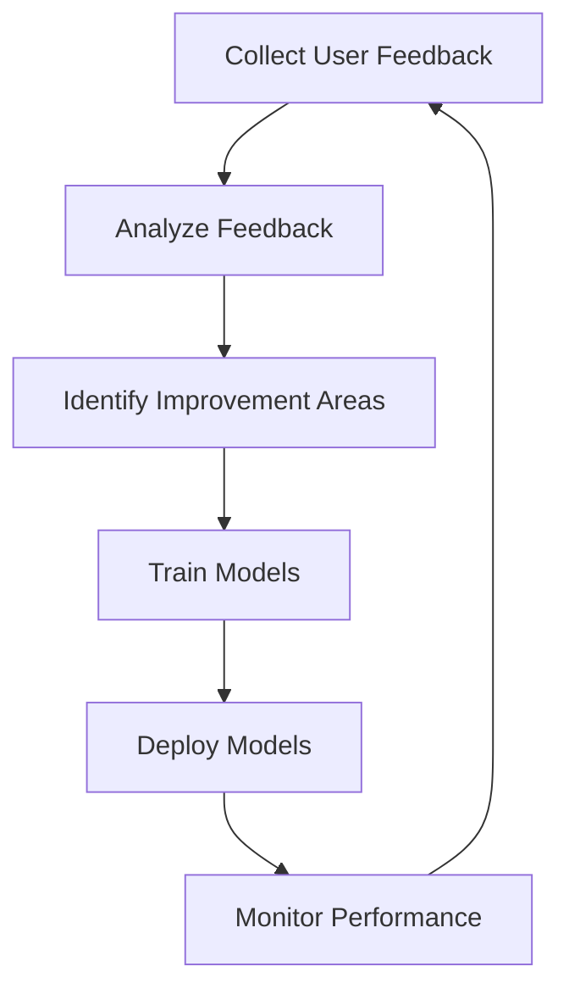

# RLHF Workflow Diagrams

This document provides visual representations of the RLHF system workflow.

## Feedback Collection Flow

## Training Pipeline Flow

## Data Flow

## Component Architecture

## Continuous Improvement Cycle

